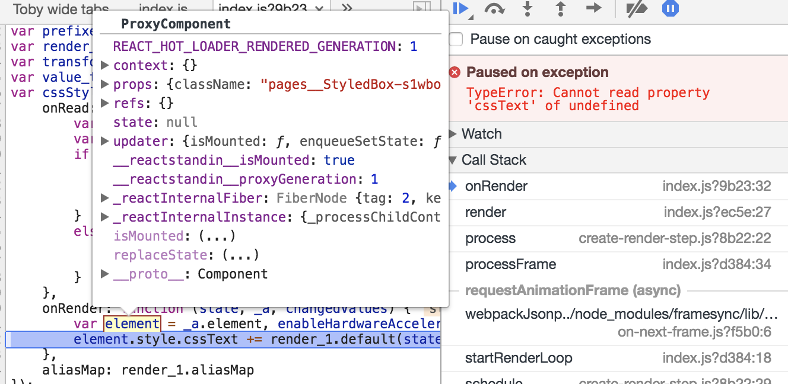

Showcasing an error that occurs in `react-pose` when posing nested styled
components in next.js

Background: https://github.com/Popmotion/popmotion/pull/276

### Run it

```
git clone https://github.com/jesstelford/react-pose-issue.git
cd react-pose-issue
npm install
npm run dev
```

Visit http://localhost:3000

See the error in the Console.

### A working version

Edit the file `pages/index.js` and uncomment this line:

```javascript
// Works
//import posed, { PoseGroup } from '@jesstelford/react-pose'
```

### The error



`ProxyComponent` comes from [within `react-hot-loader`](https://github.com/gaearon/react-hot-loader/blob/36e8ac7ed16fd8d0f22c153688aa445cde4504cc/src/proxy/utils.js#L75)
